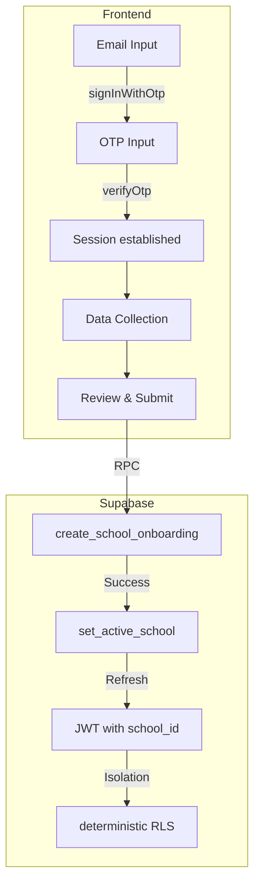

# Requirements

### Overview & Goals
Redesign and fix the onboarding system to be deterministic, failure-safe, and secure. The goal is to separate authentication from data collection and use a transactional backend commit for school creation, ensuring no partial states and strict tenant isolation.

### Scope
- **In Scope**:
    - **Authentication**: Implementing Supabase OTP-based registration.
    - **Onboarding Flow**: 4-step frontend flow (OTP Start -> Verify -> Data Collection -> Final Review).
    - **Database RPCs**: Atomic `create_school_onboarding` and `set_active_school`.
    - **Security**: JWT-based RLS standard and Auth Hook for tenant isolation.
- **Out of Scope**:
    - Redesigning existing dashboard features.
    - Implementing payment gateway integrations.

### Correct Onboarding Flow
1. **Step 1: Admin Account (OTP Start)**: User enters email. System calls `signInWithOtp`.
2. **Step 2: OTP Verification**: User enters code. System calls `verifyOtp`, establishing a Supabase session.
3. **Step 3: School Details**: Authenticated user provides school name, subdomain, and profile name.
4. **Step 4: Review & Submit**: Final review. On click, call `create_school_onboarding` (RPC) then `set_active_school` (RPC).

# Technical Design

### Current Implementation Issues
- **Mixed Logic**: Auth, onboarding, and school creation happen in a single step, leading to failures if email verification is pending.
- **Insecure RLS**: Relies on DB-based lookups (`current_user_school`) which can be slow and non-deterministic.
- **Unreliable RPC**: Current onboarding logic is not fully transactional or fails to handle authenticated states correctly.
- **Partial States**: Possible to create a user without a school or a school without a member if the process is interrupted.

### Proposed Changes

#### 1. Backend: JWT Authority (Auth Hook)
We will implement a Supabase Auth Hook to inject tenant context directly into the JWT.
- **Hook Function**: `auth.custom_access_token_hook`
- **Claims**: `school_id`, `role`, `is_platform_admin`.
- **Source of Truth**: The `auth.users.raw_user_meta_data->'active_school_id'` and `school_members` table.

#### 2. Backend: Transactional RPCs
- **`create_school_onboarding`**:
    - Validates `auth.uid()` is present.
    - Creates `schools` record (state='draft').
    - Creates `subscriptions` record (status='trialing').
    - Assigns user the `SCHOOL_OWNER` role in `school_members`.
    - Updates user profile name.
    - Returns `school_id`.
- **`set_active_school`**:
    - Validates membership.
    - Updates `auth.users.raw_user_meta_data->'active_school_id'`.

#### 3. Database: Deterministic RLS Standard
Migrate all tables to use the JWT claim check:
```sql
USING (
  (auth.jwt() -> 'app_metadata' ->> 'is_platform_admin')::boolean = true
  OR school_id = (auth.jwt() -> 'app_metadata' ->> 'school_id')::uuid
)
```

#### 4. Frontend: Onboarding State Machine
Update `OnboardingPage.tsx` to handle the following states:
`IDLE` -> `OTP_SENT` -> `OTP_VERIFIED` -> `DATA_COLLECTION` -> `REVIEW` -> `SUBMITTING` -> `COMPLETED`.

### Architecture Diagram


# Testing

### Validation Approach
Verify the end-to-end onboarding flow, ensuring that auth is required and isolation is guaranteed.

### Key Scenarios
- **OTP Verification**: Verify that a user cannot proceed to data collection without valid OTP.
- **Session Continuity**: Verify that refreshing the page after OTP verification retains the session but requires re-entering onboarding data if not committed.
- **Atomic Creation**: Verify that if `create_school_onboarding` fails (e.g., duplicate subdomain), no school record or member record is left behind.
- **Tenant Isolation**: Verify that after onboarding, the user can only access data for their new school.
- **Admin Bypass**: Verify platform admins can still access all schools while the new RLS standard is in place.

# Delivery Plan

### ✓ Step 1: Implement Tenant Authority via Supabase Auth Hooks
Establish the deterministic tenant authority using Supabase Auth Hooks.
- Create `auth.custom_access_token_hook` to inject `school_id`, `role`, and `is_platform_admin` into JWT.
- Implement `rpc.set_active_school(target_school_id)` to update user metadata safely.
- Add `is_platform_admin()` helper that reads directly from JWT claims.
- Outcome: JWT becomes the single source of truth for tenant identity.

### ✓ Step 2: Standardize RLS to Deterministic JWT-based Enforcement
Refactor Row Level Security across all tables to use JWT claims exclusively.
- Update the RLS policy macro to use `auth.jwt() -> 'app_metadata' ->> 'school_id'`.
- Replace all calls to `current_user_school()` with JWT-based logic.
- Ensure Platform Admins have bypass access via the `is_platform_admin` claim.
- Outcome: Data isolation is enforced without expensive DB lookups in RLS.

### ✓ Step 3: Centralize RBAC and Feature Gating in Postgres
Move RBAC and Feature Gating from the frontend to the database layer.
- Create `user_can(permission_key)` and `school_has_feature(feature_key)` helper functions.
- Update RLS policies for modules (e.g., exams, finance) to check both `school_id` and feature status.
- Implement a unified `user_permissions_view` for auditability.
- Outcome: Security policies are enforced at the API level, preventing UI-only bypasses.

### ✓ Step 4: Update Frontend for JWT Context and Subdomain Sync
Align the React application with the new deterministic auth model.
- Update `useAuth` hook to detect and handle tenant context mismatches.
- Implement a \"Switch School\" modal/prompt when navigating subdomains.
- Sync `appStore` state with the injected JWT claims.
- Outcome: Consistent UX where UI context always matches database enforcement.